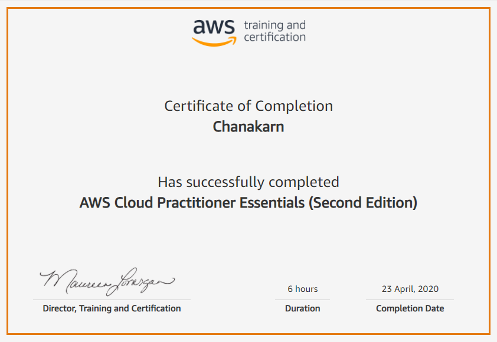
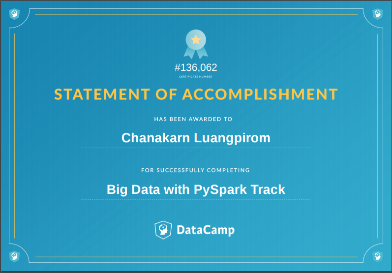

<!-- 
For now, this page is assumed to be a static description of your courses. You can convert it to a collection similar to `_projects/` so that you can have a dedicated page for each course.

Organize your courses by years, topics, or universities, however you like! -->

